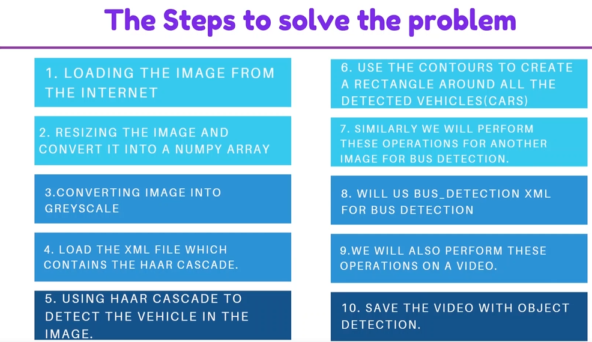
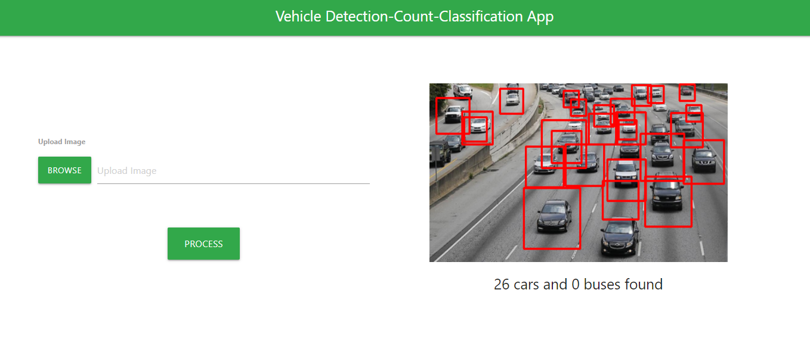

In this project, we will be working on detecting and counting vehicles in a given image or a video. We will be using OpenCV for image processing and Haar cascade which is used for object detection. We can also create our own customized haar cascade classifier.

# Installation

- 1 - create a virtual environment and activate
- 2 - pip install virtualenv
- - virtualenv envname
- - envname\scripts\activate
- 3 - cd into project
- 4 - pip install -r requirements.txt
- 5 - py app.py

# Steps

# HomePage

We started with downloading the image we will be working on and performed different operations on that image. We saw how we can use haar cascade which is used for object detection. We saw how different haar cascade is used for car detection, bus detection. Similarly, you can use many pretrained haar cascades for different object detection.
